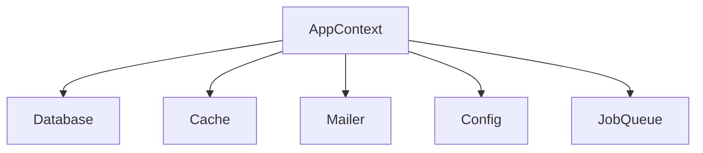
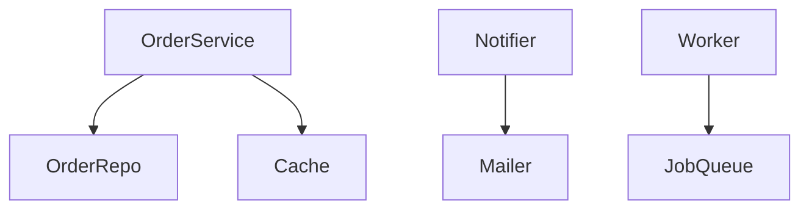
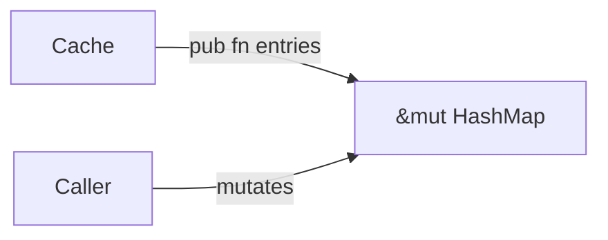
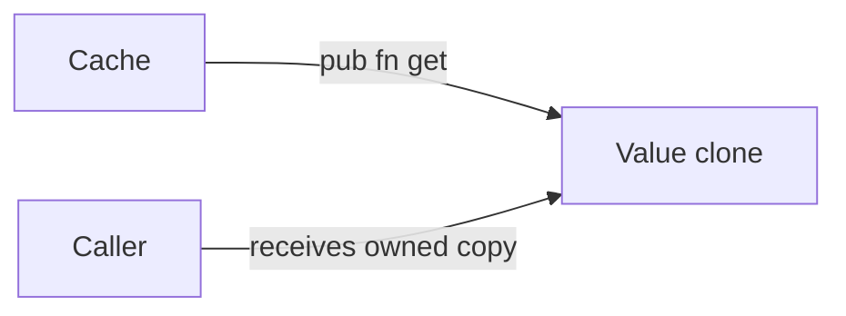
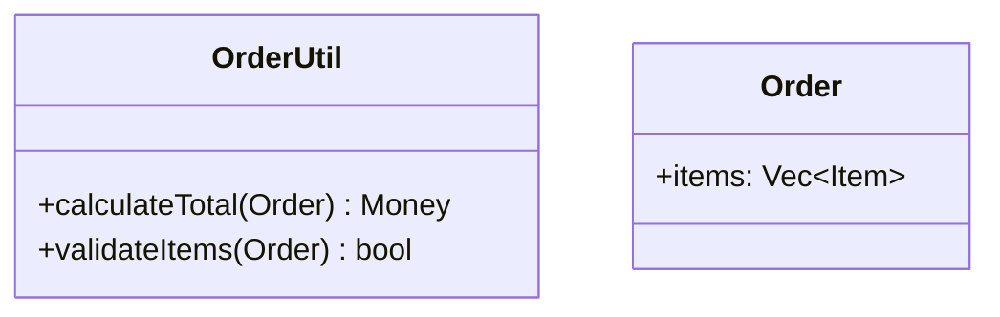
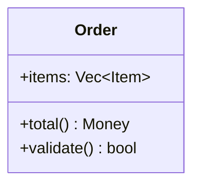
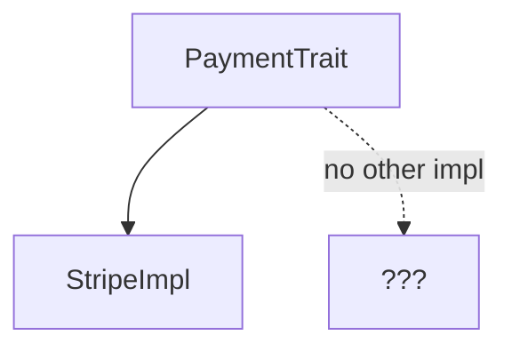
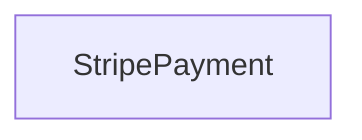

# Mermaid Diagram Conventions

Use the simplest diagram that communicates the structural change. Prefer fewer nodes over completeness.

---

## Diagram Type Selection

| Structural concern                        | Diagram type                         | Example                                  |
| ----------------------------------------- | ------------------------------------ | ---------------------------------------- |
| Type splitting / god object decomposition | `graph TD` with boxes                | Split a fat class into 3 focused classes |
| Dependency direction                      | `graph LR` or `graph TD` with arrows | Show import direction between modules    |
| Method ownership / API surface            | `classDiagram`                       | Show methods moving between types        |
| Data flow / state leak                    | `graph LR`                           | Show internal state escaping to callers  |

---

## Simplicity Rules

### Node limit
Keep nodes to 3–7 per diagram. If you need more, reconsider: the diagram is trying to show too much. Split into two diagrams or simplify the view.

### Node naming
- Use short, descriptive names: `UserRepo` not `UserRepositoryImplementation`.
- Use the actual type/struct name from the codebase when referencing a real type.
- For proposed new types, use names that match the fix strategy.

### Arrow style
- `-->` for dependency/import arrows.
- `--|>` for inheritance/implementation.
- `..>` for data flow or weak dependency.
- Add labels only when the arrow's meaning is not obvious from context.

### Avoid
- Subgraphs unless the nesting is essential to understanding the problem.
- `style` declarations unless highlighting one specific problem node.
- Click handlers, CSS classes, or any interactive features.
- Complex arrows like `o--`, `x--` unless strictly necessary.

---

## Diagram Patterns

### Before: God object (problem)

### After: God object (fix)

### Before: Leaked state (problem)

### After: Leaked state (fix)

### Before: Wrong method placement (problem)

### After: Wrong method placement (fix)

### Before: Speculative abstraction (problem)

### After: Speculative abstraction (fix)

---

## Anti-patterns

- **Too many nodes:** A diagram with 15 boxes is a wall of text. Split it.
- **No change between before/after:** If both diagrams look the same, the finding is not structural.
- **Orphan nodes:** Every node should have at least one edge unless it's the root of a new standalone concept.
- **Bidirectional arrows:** Use two separate arrows or reconsider the dependency. Bidirectional arrows hide cycles.
