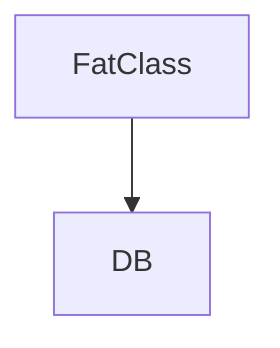

# HTML Report Template

Generate the report at `.grimoire/improve-report.html`. Every finding uses the structure below.

---

## Full page structure

```html
<!DOCTYPE html>
<html lang="en">
<head>
    <meta charset="UTF-8">
    <meta name="viewport" content="width=device-width, initial-scale=1.0">
    <title>Grimoire Improve — Code Quality Audit</title>
    <script src="https://cdn.jsdelivr.net/npm/mermaid/dist/mermaid.min.js"></script>
    <script>mermaid.initialize({ startOnLoad: true, theme: 'default' });</script>
    <style>
        body { font-family: -apple-system, BlinkMacSystemFont, 'Segoe UI', sans-serif; max-width: 900px; margin: 0 auto; padding: 2em; background: #fff; color: #222; }
        h1 { border-bottom: 2px solid #eee; padding-bottom: 0.3em; }
        .meta { color: #666; font-size: 0.9em; margin-bottom: 2em; }
        .finding { border: 1px solid #ddd; border-radius: 8px; padding: 1.5em; margin: 1.5em 0; }
        .finding h2 { margin-top: 0; display: flex; justify-content: space-between; align-items: center; }
        .score { font-size: 0.7em; padding: 0.3em 0.7em; border-radius: 4px; color: #fff; }
        .score-5 { background: #d32f2f; } .score-4 { background: #e64a19; } .score-3 { background: #f57c00; } .score-2 { background: #388e3c; } .score-1 { background: #78909c; }
        .dimension { color: #888; font-weight: normal; font-size: 0.8em; }
        .location { font-family: monospace; background: #f5f5f5; padding: 0.2em 0.5em; border-radius: 3px; }
        .problem, .strategy, .benefit { margin: 1em 0; }
        .problem h4, .strategy h4, .benefit h4 { margin-bottom: 0.3em; color: #555; }
        .diagrams { display: flex; gap: 1.5em; margin: 1.5em 0; }
        .diagram-box { flex: 1; min-width: 0; }
        .diagram-box h4 { text-align: center; margin-bottom: 0.5em; }
        .diagram-box .badge { font-size: 0.75em; padding: 0.15em 0.5em; border-radius: 3px; }
        .badge-before { background: #ffebee; color: #c62828; }
        .badge-after { background: #e8f5e9; color: #2e7d32; }
        .mermaid { display: flex; justify-content: center; }
        pre { background: #fafafa; border: 1px solid #eee; padding: 0.8em; border-radius: 4px; overflow-x: auto; font-size: 0.85em; }
        hr { border: none; border-top: 1px solid #eee; }
    </style>
</head>
<body>
    <h1>🔍 Grimoire Improve — Code Quality Audit</h1>
    <p class="meta">Generated: {TIMESTAMP} | Repository: {REPO_NAME} | Language: {LANGUAGE}</p>

    <!-- FINDING BLOCK — repeat for each finding -->

    <div class="finding">
        <h2>
            <span><span class="dimension">#{N}: {DIMENSION_NAME}</span> — {SHORT_TITLE}</span>
            <span class="score score-{SCORE}">Priority {SCORE}/5</span>
        </h2>

        <p class="location">📍 {FILE_PATH}:{LINE_RANGE}</p>

        <div class="problem">
            <h4>Problem</h4>
            <p>{PROBLEM_DESCRIPTION}</p>
            <pre>{CODE_SNIPPET}</pre>
        </div>

        <div class="diagrams">
            <div class="diagram-box">
                <h4><span class="badge badge-before">Before</span></h4>
                <div class="mermaid">
{MERMAID_BEFORE}
                </div>
            </div>
            <div class="diagram-box">
                <h4><span class="badge badge-after">After</span></h4>
                <div class="mermaid">
{MERMAID_AFTER}
                </div>
            </div>
        </div>

        <div class="strategy">
            <h4>Fix Strategy</h4>
            <p>{STRATEGY_STEPS}</p>
        </div>

        <div class="benefit">
            <h4>Expected Benefit</h4>
            <p>{BENEFIT_DESCRIPTION}</p>
        </div>
    </div>

    <hr>

    <!-- END FINDING BLOCK -->

    <p style="color: #999; font-size: 0.85em; text-align: center; margin-top: 2em;">
        Tell the agent which findings to fix (e.g. "fix 1,3,4") — it will hand each off to <code>grimoire-implement</code> in priority order.<br>
        Then run <code>grimoire-improve</code> again to surface the next priorities.
    </p>
</body>
</html>
```

---

## Placeholder Reference

| Placeholder                | What goes there                                              |
| -------------------------- | ------------------------------------------------------------ |
| `{TIMESTAMP}`              | ISO 8601 timestamp of generation, e.g. `2026-01-15T14:30:00` |
| `{REPO_NAME}`              | Repository or project name                                   |
| `{LANGUAGE}`               | Primary language (Rust, TypeScript, Python, Go, etc.)        |
| `{N}`                      | Finding number (1–5)                                         |
| `{DIMENSION_NAME}`         | Exact dimension name from the checklist, e.g. "God Object"   |
| `{SHORT_TITLE}`            | One-line summary, e.g. "AppContext owns everything"          |
| `{SCORE}`                  | Integer 1–5                                                  |
| `{FILE_PATH}:{LINE_RANGE}` | Specific file and lines, e.g. `src/core/context.rs:15-120`   |
| `{PROBLEM_DESCRIPTION}`    | 2–4 sentences on what's wrong and why it matters             |
| `{CODE_SNIPPET}`           | 3–10 lines of actual code showing the problem                |
| `{MERMAID_BEFORE}`         | Mermaid diagram source (not wrapped in ```mermaid)           |
| `{MERMAID_AFTER}`          | Mermaid diagram source (not wrapped in ```mermaid)           |
| `{STRATEGY_STEPS}`         | 2–5 specific, ordered steps to fix the issue                 |
| `{BENEFIT_DESCRIPTION}`    | 2–3 sentences on what improves after the fix                 |

---

## Mermaid rendering

Place raw Mermaid source inside `<div class="mermaid">`. Do NOT wrap in code fences (` ```mermaid `). Mermaid.js auto-detects `<div class="mermaid">` elements.

Correct:
```html
<div class="mermaid">
graph TD
    A[FatClass] --> B[DB]
    A --> C[Cache]
</div>
```

Incorrect:
```html
<div class="mermaid">

</div>
```

---

## Score coloring

| Score | Color                 | Meaning                                 |
| ----- | --------------------- | --------------------------------------- |
| 5     | Red (#d32f2f)         | Fix now — actively hurting development  |
| 4     | Deep orange (#e64a19) | Fix soon — causing friction or bugs     |
| 3     | Orange (#f57c00)      | Worth fixing — measurable improvement   |
| 2     | Green (#388e3c)       | Nice to have — low impact, low effort   |
| 1     | Grey (#78909c)        | Cosmetic — mention but don't prioritize |
