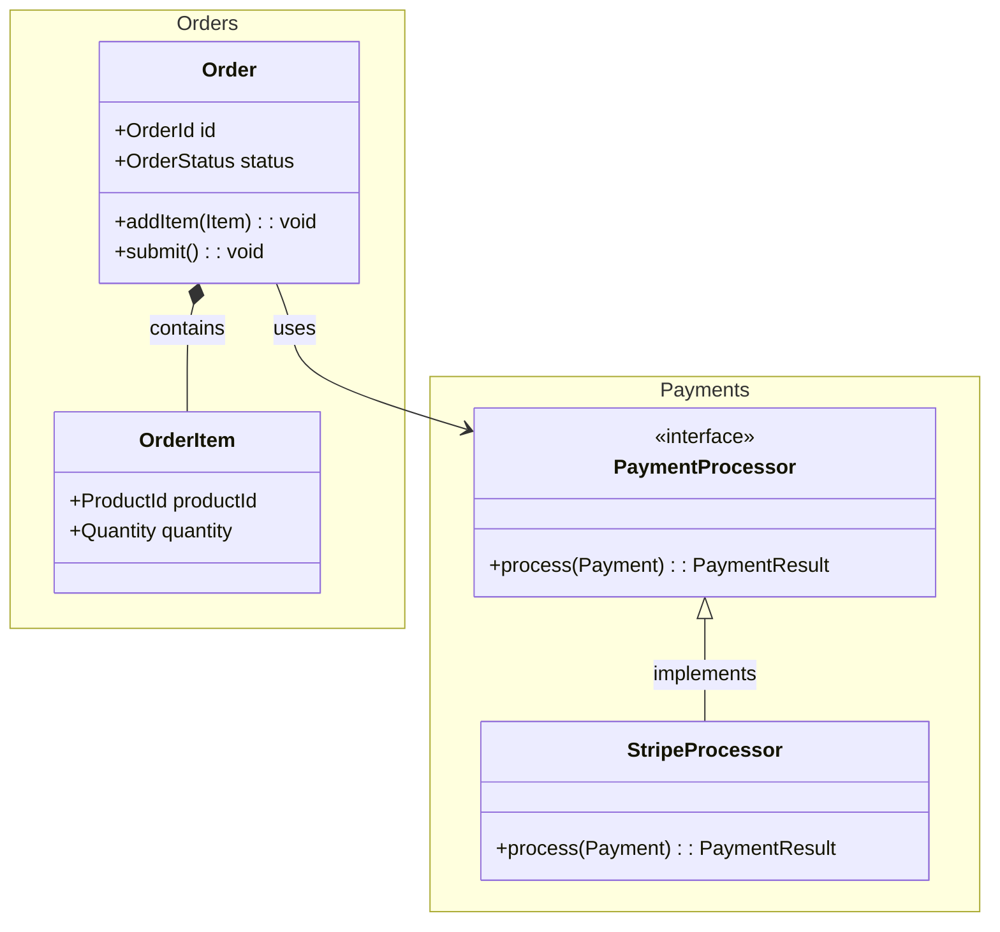

# Type Relationship Diagram Guide

Use this guide to produce the Mermaid classDiagram in step 3.

---

# Relationship Types

Map design relationships to Mermaid syntax:

| Relationship             | Mermaid Syntax | When to Use                                                    |
| ------------------------ | -------------- | -------------------------------------------------------------- |
| Composition (owns)       | `*--`          | One type owns another; the part cannot exist independently.    |
| Aggregation (references) | `o--`          | One type references another; the part can exist independently. |
| Implementation           | `<--`          |                                                                | A type implements an interface/trait.        |
| Inheritance              | `<--`          |                                                                | A type extends a base class (use sparingly). |
| Usage dependency         | `-->`          | A type uses another as a parameter, return type, or temporary. |

---

# Diagram Rules

1. Include every type from step 3.
2. For each type, show only the fields and methods relevant to the plan — not every member.
3. Use relationship arrows to show how types connect.
4. Group related types using Mermaid's `namespace` when helpful.
5. Prefer composition arrows (`*--`) over inheritance arrows (`<|--`).

---

# Example

