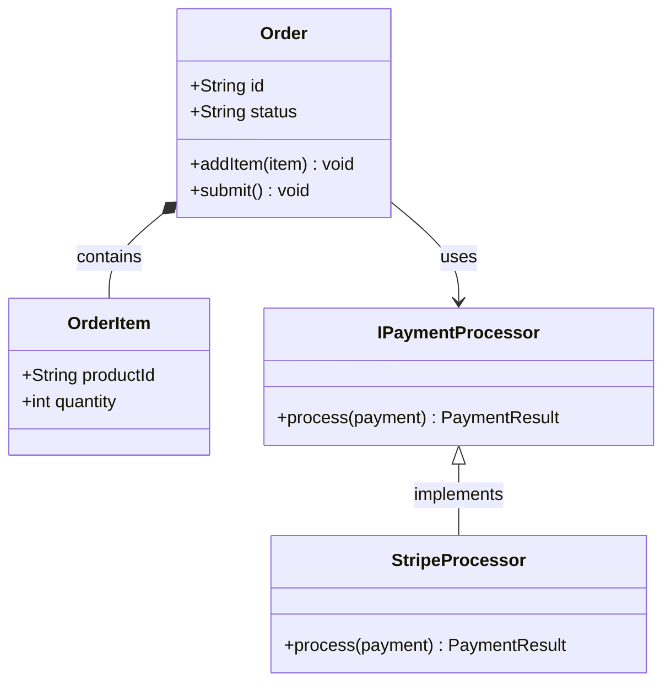

# Type Relationship Diagram Guide

Use this guide to produce the Mermaid classDiagram in step 3.

---

# Simplicity First

Mermaid classDiagram has many features, but complex syntax causes rendering errors. **Only use the basic syntax described here.** Avoid: `namespace`, `<<stereotype>>`, generics (`List~T~`), annotations, cardinality/multiplicity labels, and member modifiers beyond `+` and `-`.

If a concept is complex, describe it in the type design tables — not in the diagram. The diagram shows structure; the tables explain it.

---

# Relationship Types

Map design relationships to Mermaid syntax:

| Relationship             | Mermaid Syntax | When to Use                                                    |
| ------------------------ | -------------- | -------------------------------------------------------------- |
| Composition (owns)       | `*--`          | One type owns another; the part cannot exist independently.    |
| Aggregation (references) | `o--`          | One type references another; the part can exist independently. |
| Implementation           | `<\|--`        | A type implements an interface/trait.                          |
| Inheritance              | `<\|--`        | A type extends a base class (use sparingly).                   |
| Usage dependency         | `-->`          | A type uses another as a parameter, return type, or temporary. |

---

# Diagram Rules

1. Include every type from step 3.
2. For each type, show only the fields and methods relevant to the plan — not every member.
3. Use relationship arrows to show how types connect.
4. Do NOT use `namespace` — it causes rendering errors in some Mermaid versions. Instead, use naming prefixes or comments to indicate grouping.
5. Prefer composition arrows (`*--`) over inheritance arrows (`<|--`).
6. Do NOT use `<<interface>>` or `<<stereotype>>` — instead, prefix interface names with `I` (e.g., `IPaymentProcessor`).
7. Use only simple field types (string, int, boolean, or plain type names). Avoid generics (`List~T~`), union types, or complex type expressions.
8. Keep class body content minimal: fields and methods on separate lines, each starting with `+` or `-`.

---

# Example

```mermaid
classDiagram
    class Order {
        +String id
        +String status
        +addItem(item) void
        +submit() void
    }
    class OrderItem {
        +String productId
        +int quantity
    }
    class IPaymentProcessor {
        +process(payment) PaymentResult
    }
    class StripeProcessor {
        +process(payment) PaymentResult
    }

    Order *-- OrderItem : contains
    Order --> IPaymentProcessor : uses
    IPaymentProcessor <|-- StripeProcessor : implements
```
