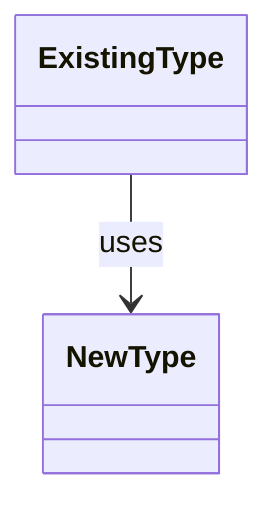

# Markdown Plan Template

Use this structure in step 7. Write the output to `.grimoire/plans/NNNN-title.md`.

Adapt or omit sections that do not apply. Do not emit empty headings or placeholder text.

````markdown
# PLAN_TITLE

- **Input:** INPUT_SOURCE
- **Date:** YYYY-MM-DD
- **Status:** Proposed

## Summary

State the intended outcome, scope, and central implementation approach.

## Design impact

### Boundary or symbol name

- **Action:** Create | Modify | Move | Remove
- **Location:** `path/to/file`
- **Responsibility:** Behavior or invariant affected.
- **Relationships:** Important dependencies or collaborators.
- **Rationale:** Why this boundary is appropriate and which meaningful alternatives were rejected.

### Design decisions

- Decision and rationale.
- Material uncertainty or assumption that implementation must verify.

## Relationship diagram

Include only when it clarifies multiple components or a non-obvious dependency change.



## Implementation steps

### 1. ACTION_VERB + target

- **Files or discovery point:** `path/to/file`, `symbolName`
- **Change:** Concrete coherent change.
- **Outcome:** Observable result.
- **Verification:** Check that proves this step works.

Add pseudocode in a fenced language block only when non-trivial logic benefits from it.

## Edge cases

| Condition | Expected behavior | Owning step or verification |
| --- | --- | --- |
| Concrete input, state, or timing | Required system behavior | Step N / named check |

## Verification strategy

| Behavior or risk | Method | Evidence |
| --- | --- | --- |
| Material behavior | Unit, integration, end-to-end, static, manual, or performance check | Expected assertion or observable result |

## Affected files

| File | Action | Purpose |
| --- | --- | --- |
| `path/to/file` | Create / Modify / Move / Remove | Why it changes |

## Risks and open questions

- **Risk:** Mitigation or verification.
- **Open question:** Discovery point or authority needed to resolve it.
````

## Formatting rules

- Use standard Markdown tables, lists, headings, and fenced code blocks.
- Use fenced `mermaid` blocks for diagrams; follow [diagram-guide.md](./diagram-guide.md).
- Link repository paths with inline code unless a navigable Markdown link is more useful.
- Keep implementation steps dependency-ordered and independently verifiable where possible.
