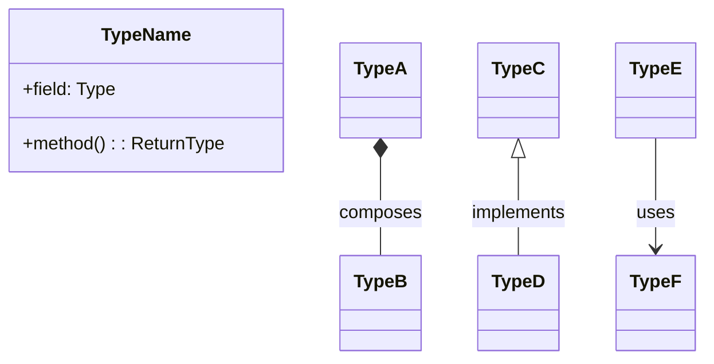

# Plan Template

Use this template when writing the plan in step 7.

---

# [Plan Title]

**Input:** [ticket path | spec path | "Conversation: <one-line goal>"]
**Date:** YYYY-MM-DD

---

## 1. Type Design

### Modified Types

| Type   | File   | Concept        | Change         | Rationale               |
| ------ | ------ | -------------- | -------------- | ----------------------- |
| [Name] | [path] | [one sentence] | [what changes] | [why extend, not split] |

### New Types

| Type   | File   | Concept        | Responsibility  | Relationships                 | Rationale               |
| ------ | ------ | -------------- | --------------- | ----------------------------- | ----------------------- |
| [Name] | [path] | [one sentence] | [rules it owns] | [what it composes/implements] | [why split, not extend] |

### Design Decisions

- [Decision 1]
- [Decision 2]

---

## 2. Type Relationship Diagram



---

## 3. Implementation Steps

### Step 1: [action verb + target + brief description]

**Files:** [path, ...]
**Action:** Modify method `X` to return Y instead of Z.
**Outcome:** [observable result]

*Pseudo-code (only when logic changes):*

```
// pseudo-code here
```

### Step N: [action verb + target + brief description]

**Files:** [path, ...]
**Action:** [what concrete change to make]
**Outcome:** [observable result]

---

## 4. Edge Cases

| #   | Condition   | Expected Behavior | Owning Step |
| --- | ----------- | ----------------- | ----------- |
| 1   | [condition] | [behavior]        | Step N      |
| 2   | [condition] | [behavior]        | Step N      |

---

## 5. Test Strategy

### [Type Name]

- **Verify:** [observable behavior]
- **Mock:** [dependencies to stub]
- **Variations:** [qualitatively different inputs]
  - [variation 1]
  - [variation 2]

---

## 6. Affected Files

| File   | Action          | Referenced By         |
| ------ | --------------- | --------------------- |
| [path] | Create / Modify | Step N, Test Strategy |
